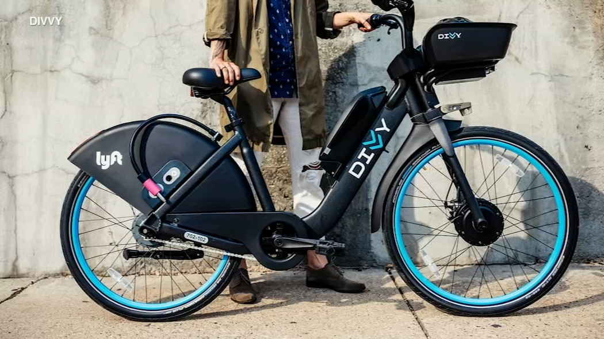
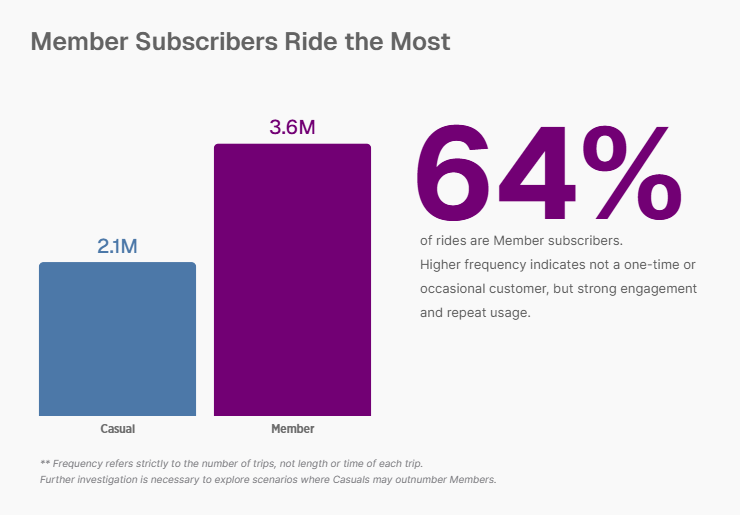
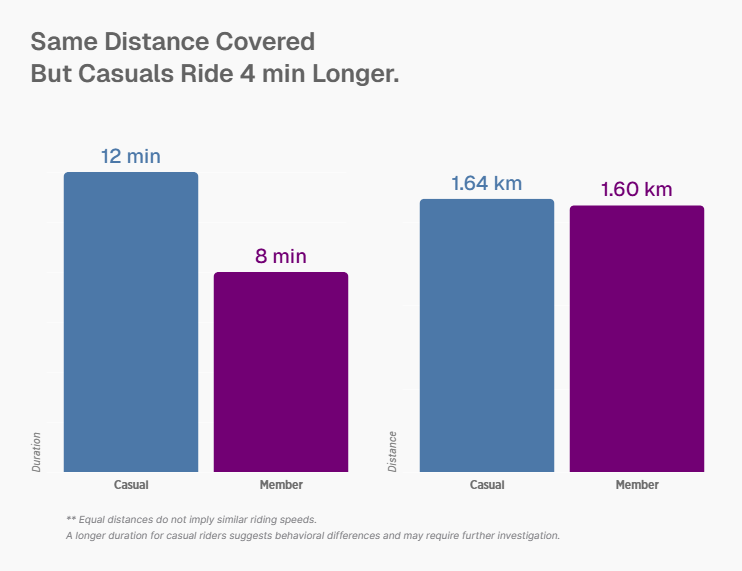
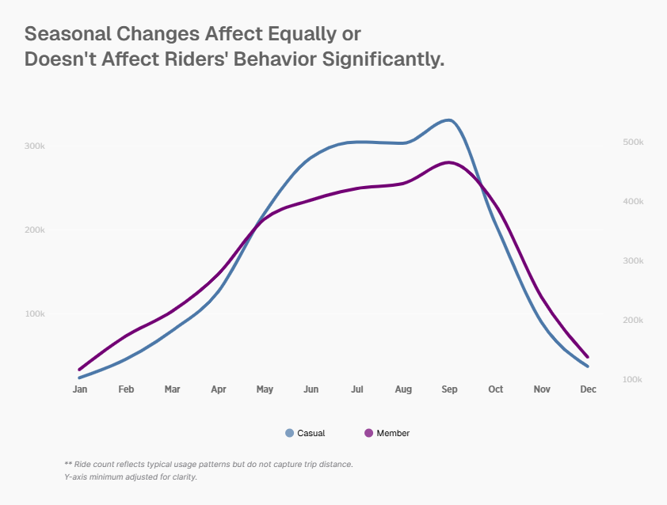
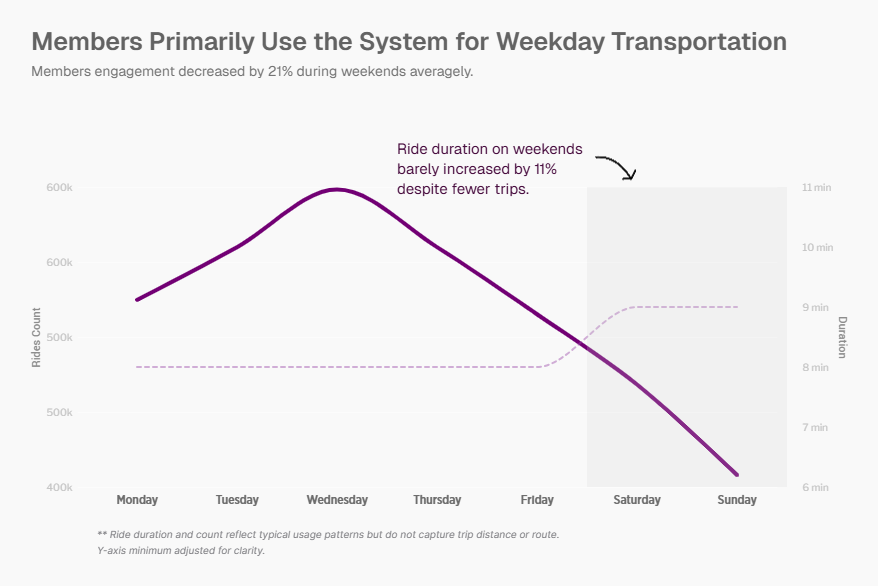
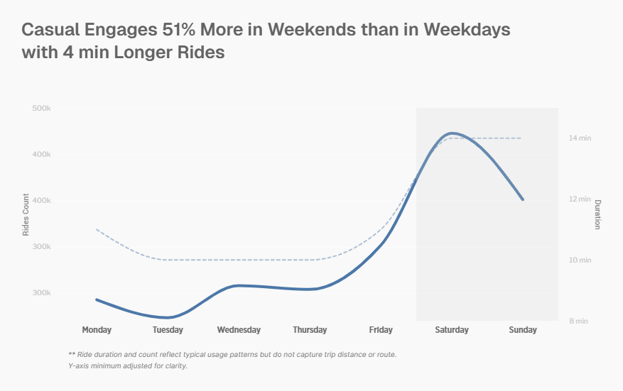
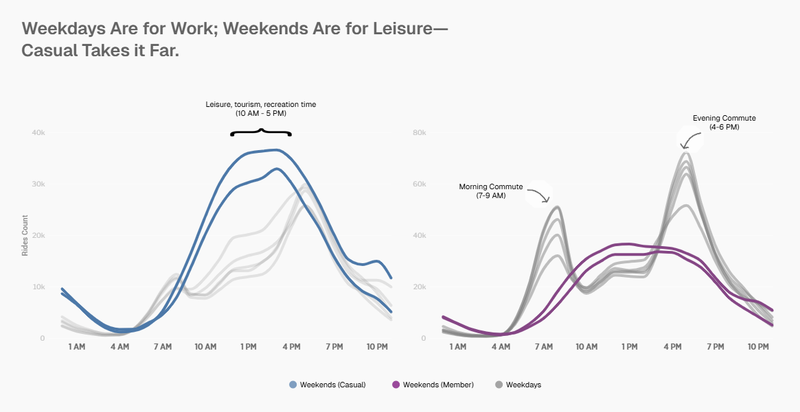

# Divvy-Lyft Customer Riding Behaviour Analysis


## Table of Contents
- [Project Overview](#project-overview)
- [Executive Summary](#executive-summary)
- [Problem Statement](#problem-statement)
- [Key Insights](#key-insights)
- [Conclusion](#conclusion)
- [Recommendations](#recommendations)
- [Skills & Tools Demonstrated](#skills--tools-demonstrated)
- [Project Workflow](#project-workflow)
- [What I Learned](#what-i-learned)
- [Lessons Learned and Future Improvements](#lessons-learned-and-future-improvements)
- [How to Setup This Project](#how-to-setup-this-project)
- [Project Structure](#project-structure)
- [Contact Me](#contact-me)

## Project Overview
This project analyzes and reports on the riding behavior of both **Casual** and **Member** riders who use **Divvy-Lyft Bike-Sharing service**. The **Marketing Department** aims to understand how these riders use the service and identify strategies to convert Casual riders into Members.

## Executive Summary
In **2024**, Divvy–Lyft bike-sharing usage showed clear differences between Casual and Member riders. Casual riders primarily used the service for **leisure** and **occasional** trips, with longer rides and higher activity on **weekends**. In contrast, Member riders used Divvy more frequently for **short**, **routine trips**, largely on weekdays, reflecting **commuting** and **daily mobility needs**.

The marketing department should focus on behaviour-based conversion, not generic membership messaging. Target frequent Casual riders who take multiple rides per month or during weekday peak hours with **personalised in-app** and **email campaigns** highlighting cost savings compared with per-ride fees. 

Promote **limited-duration memberships** (e.g., 30-day or summer passes) at tourist-heavy stations and during peak seasons to lower commitment barriers.   
Use **post-ride prompts** that show “you would have saved X as a member” to reinforce value immediately after use, and partner with city events and employers to position membership as a practical, everyday mobility solution rather than a recreational option.

## Problem Statement
The **Marketing department** at **Lyft** aims to maximise annual memberships, as the director believes this is key to long-term success. This analysis examines and reports differences in **riding behaviour** between **Casual** and **Member** riders to support this goal.   
By examining trip duration, ride frequency, peak usage times, and common routes over the past **12 months in 2024**, we will uncover insights that can guide targeted marketing strategies to convert more casual riders into annual members.

## Key Insights
1. **Members Drive the Majority of Divvy Rides**
  
  
  Members account for **64%** of total rides, compared to **36%** from casual riders, indicating more consistent and frequent usage driven by **strong retention** and **habitual riding**. However, trip counts alone do not reflect ride distance or duration, and further analysis is required to identify when and where Casual riders may exceed Members in usage.

2. **Casual and Member Riders Travel Similar Distances but at Different Durations.**   

 Although both groups travel nearly identical distances—about **1.6 km** on average—Casual riders take significantly longer to complete their trips, with a duration of **12 minutes** compared to **8 minutes** for Members. This indicates that the key difference between the two groups is not how far they travel, but **how they travel**. 

 Members appear to ride more efficiently and consistent with routine such as commuting, while Casual riders likely use the service for leisure, sightseeing, or unfamiliar navigation. These patterns highlight two distinct user behaviors within the system and suggest that further analysis of ride patterns by time of day, day of week, and station location will provide deeper insight.

 3. **Seasonality Affects Casual and Member Riders Similarly.**   
 

 Seasonality does not significantly differentiate rider behaviour between **Casual** and **Member** users. Instead, it acts as a **shared external driver influencing both groups** in the same way over time.
This ensures that subsequent insights derived from **hour-level analysis** are robust across seasons and will not be distorted by **seasonal fluctuations** in total ridership.

4. **Members Primary use the System for Commuting.**


Members show higher engagement on weekdays, peaking on **Wednesdays**, which aligns with Chicago’s busiest midweek travel days. Interestingly, member trip duration increases by **11%** on weekends, indicating that some members also use the service for leisure purposes in addition to routine commuting.

5. **Casual Engages More in Weekends than in Weekdays**


Casual riders are primarily **weekend users**. Their engagement increased **51%** more in weekend than in weekday and they ride **4 min** longer. Weekend rides are **leisure-oriented trips**, while weekday trips are **limited** and **short**.   
The conclusion that **all Casual** riders are leisure-oriented cannot be made immediately, as members also show longer trip durations on weekends. Further analysis is needed to determine what proportion of Casual riders are truly leisure-oriented versus members who use the service for commuting.

6. **Weekdays are for Work and Weekend are for Leisure But Casual Takes it Far.**


Both rider types exhibit similar patterns, with commuting peaks between **7–9 AM** and **4–6 PM** on weekdays, and leisure peaks between **11 AM–4 PM** on weekends. However, Casual rider volume increases by **52%** on weekends, while Member volume decreases by **21%**. This suggests that some casual riders use the service for both commuting and leisure, making them prime targets for marketing campaigns aimed at converting them into Members.

## Conclusion
 There is a clear distinction in how **Member** and **Casual** riders use the bike-sharing service: Members are predominantly **commute-oriented**, while Casual riders are primarily **leisure-oriented**.

However, the analysis also reveals overlap in behavior. Some Casual riders exhibit commuting-like patterns on weekdays, and some Members use the service for leisure during weekends. Due to the **anonymized nature of the dataset**, it is not possible to reliably classify individual riders as exclusively leisure-based, commute-based, or mixed-use over time.

The inclusion of additional user-level attributes such as **rider name and id**, **history**, **subscription tenure**, or inferred trip purpose would enable more precise behavioral segmentation. This information would significantly improve the ability of the marketing team to identify high-value Casual riders with strong conversion potential to Membership, leading to more targeted and effective campaigns.


## Recommendations
1. **Convert High-Frequency Casual Riders Who Commute on Weekdays**.   
Focus marketing efforts on Casual riders with weekday, peak-hour usage patterns, as their behavior closely mirrors that of Members. These riders represent the lowest-friction conversion opportunity.   
The marketing team can deploy **targeted in-app** and **email campaigns** during weekday mornings and evenings that emphasize cost savings, time efficiency, and reliability of Membership versus single-ride pricing.

2. **Use Location-Based Marketing at Leisure and Residential Hotspots.**  
Casual usage is concentrated around **tourist and recreational areas**, while Member usage aligns with **residential and employment districts**. Marketing messages should adapt based on where rides begin.   
The team can promote leisure and exploration messaging near parks and waterfronts and send commuter-focused Membership offers when Casual riders start trips near residential zones


3. **Introduce Flexible Membership Options for Mixed-Use Riders**
A significant portion of riders demonstrate both leisure and commuting behavior, especially across weekdays and weekends. A single annual plan may be too restrictive for this segment.   
Therefore, the team can offer or promote **flexible plans** such as weekday-only passes, seasonal memberships, or bundled ride credits.

## Skills & Tools Demonstrated
1. **dbt (Data Build Tools)**: Designed, tested, and materialized analytic-ready models using **Jinja macros** and **seed files** for auxiliary tables. Validated data quality with dbt tests and compiled models using **dbt Fusion**.
2. **Databricks (SQL)**: Integrated dbt with the **Databricks platform**, materializing models as tables. Managed table storage and merges within Databricks and conducted exploratory analysis using **Databricks SQL Dashboards**.
3. **Altair-Vega (Python)**: Built clear and expressive visualizations, including line chart and bar charts using the **Altair (Vega-Lite)** library.

## Project Workflow
### Data Sourcing, Extraction and Storing
The data has been made available by **Divvy-Lyft Bike-Sharing** under this [license](https://divvybikes.com/data-license-agreement).

The data source is partitioned into **twelve zip folders**. Each zip folder contains a .csv file for a particular month in **2024**. The zip folder and .csv file are named: `YYYYMM-divvy-tripdata` and `YYYMM-divvy-tripdata.csv` respectively.   
[You can view and download the dataset](https://divvy-tripdata.s3.amazonaws.com/index.html).

Each .csv file was stored at **Databricks** (a cloud-based data platform) under the catalog `divvy-trip` and schema `default`.

### Data Transformation with dbt (Data Build Tools)
1. Each .csv trip data was appended into one table and stored in **Databricks** under the catalog `divvy-trip` and schema `default` with the name: `divvy_tripdata_2024`.

  *The sql code to append each .csv into one.*
  ```sql
    {{
      config(
        materialized = 'table',
        )
    }}

    {% set tables = dbt_utils.get_relations_by_pattern(
        schema_pattern='default',
        table_pattern='2024%_divvy_tripdata'
    ) %}

    
    SELECT *
    FROM {{ table }}
    
    UNION ALL
    
    
  ```

Each trip is **anonymized** and includes the following fields:

| field | type | description|
|-------|------|------------|
| **ride_id** | string | Unique ride identifier |
| **rideable_type** | string | Types of rideable |
| **started_at** | timestamp | Ride start time |
| **ended_at** | timestamp | Ride end time |
| **start_station_name** | string | Ride start station name |
| **end_station_name** | string | Ride end station name |
| **start_station_id** | string | Ride start station id |
| **end_station_id** | string | Ride end station id |
| **start_lat** | double | Ride starting latitude |
| **start_lng** | double | Ride starting longitude |
| **end_lat** | double | Ride ending latitude |
| **end_lng** | double | Ride ending longtitude|
| **member_casual** | string | Subscriber type |

2. Each field was **cleaned** and **normalized**.   
Before cleaning and filtering, the appended dataset was indexed using a newly created column, `rn`, which uniquely identifies each trip. This index enables reliable tracking of individual records and simplifies join and other relational operations throughout the data pipeline.
```sql
SELECT
    ROW_NUMBER() OVER(ORDER BY ride_id) as rn,
    *
FROM
    {{ ref('divvy_tripdata_2024') }}
```
  - `ride_id`: The ride_id field is **unique** and should not be empty or duplicated. `ride_id` was trimmed before it was filtered.
  ```sql
  SELECT
    rn,
    TRIM(ride_id) AS ride_id
FROM
    {{ ref('stag_divvy_tripdata_2024') }}
```

  - `rideable_type`: The rideable type was transformed from snake-case to proper name (`Electric Bike`, `Classic Bike`, `Electric Scooter` and `Scooter`).

  ```sql
    SELECT
      rn,
      CASE
          WHEN TRIM(rideable_type) = "electric_bike" THEN "Electric Bike"
          WHEN TRIM(rideable_type) = "classic_bike" THEN "Classic Bike"
          WHEN TRIM(rideable_type) = "scooter" THEN "scooter"
          WHEN TRIM(rideable_type) = "electric_scooter" THEN "Electric Scooter"
          ELSE "Unknown Rideable"
      END AS rideable_type
    FROM
        {{ ref('stag_divvy_tripdata_2024') }}
  ```
  - `member_casual`: It was only capitalized.
  ```sql
    SELECT
      rn,
      INITCAP(TRIM(member_casual)) AS member_casual
  FROM
      {{ ref('stag_divvy_tripdata_2024') }}
  ```

  - `start_station_name`, `end_station_name`: Both were trimmed and any empty value was coalesced into `Unkwown Station`.
  ```sql
  SELECT
    rn,
    COALESCE(TRIM(BOTH '*' FROM TRIM(start_station_name)), "Unknown Station") AS start_station_name
  FROM
      {{ ref('stag_divvy_tripdata_2024') }}
  ```
  ```sql
  SELECT
    rn,
    COALESCE(TRIM(BOTH '*' FROM TRIM(end_station_name)), "Unknown Station") AS end_station_name
  FROM
      {{ ref('stag_divvy_tripdata_2024') }}
  ```

  - `end_station_id`, `start_station_id`: Both were trimmed and any empty value was coalesced into ` Unknown ID`.
  ```sql
  SELECT
    rn,
    COALESCE(TRIM(end_station_id), "Unknown ID") AS end_station_id
  FROM
      {{ ref('stag_divvy_tripdata_2024') }}
  ```
  ```sql
  SELECT
    rn,
    COALESCE(TRIM(start_station_id), "Unknown ID") AS start_station_id
  FROM
      {{ ref('stag_divvy_tripdata_2024') }}
  ```
  - `end_lat`, `end_lng`, `start_lat`, `start_lng`: They were rounded into five decimal places.
  ```sql
  SELECT
    rn,
    ROUND(end_lat, 5) AS end_lat
  FROM
      {{ ref('stag_divvy_tripdata_2024') }}
  ```
3. Each field was then **filtered** according to abnomalies and rules defined by the Marketing department.  
Each cleaned field was joined together into one cleaned table `merged_cleaned_fields_divvy_tripdata_2024`.
```sql
SELECT *
FROM {{ ref('ride_id_cleaned') }}
INNER JOIN {{ ref('rideable_type_cleaned') }} USING (rn)
INNER JOIN {{ ref('member_casual_cleaned') }} USING (rn)
INNER JOIN {{ ref('start_station_name_cleaned') }} USING (rn)
INNER JOIN {{ ref('end_station_name_cleaned') }} USING (rn)
INNER JOIN {{ ref('end_station_id_cleaned') }} USING (rn)
INNER JOIN {{ ref('start_station_id_cleaned') }} USING (rn)
INNER JOIN {{ ref('end_lat_cleaned') }} USING (rn)
INNER JOIN {{ ref('end_lng_cleaned') }} USING (rn)
INNER JOIN {{ ref('start_lat_cleaned') }} USING (rn)
INNER JOIN {{ ref('start_lng_cleaned') }} USING (rn)
INNER JOIN {{ ref('started_at_cleaned') }} USING (rn)
INNER JOIN {{ ref('ended_at_cleaned') }} USING (rn)
ORDER BY rn
```
  - `ride_id`: Any **duplicate ride** was **removed** from the dataset.
  ```sql
  
  SELECT
      
          {{ field }}
          
              ,
          
      
  FROM (
      SELECT
          *,
          ROW_NUMBER() OVER(PARTITION BY ride_id ORDER BY started_at) AS ride_id_rn
      FROM
          {{ ref('merge_cleaned_fields_divvy_tripdata_2024') }}
      ORDER BY ride_id
  )
  WHERE ride_id_rn = 1
  ```

  - `started_at`, `ended_at`: Any ride with the `started_at` time greater than the `ended_at` was also removed.
  ```sql
  SELECT
    *
  FROM
      {{ ref('01_ride_id_filtered') }}
  WHERE started_at < ended_at
  ```
  Also, any trip with **duration** less than **60 seconds** and greater than **1 hour** was removed.
  ```sql
  SELECT
    *
  FROM
      {{ ref('02_started_at_filtered') }}
  WHERE TIMESTAMPDIFF(Minute, started_at, ended_at) BETWEEN 1 AND 60
  ```

  - `start_lng`, `end_lng`: Any trip with longitude outside the boundaries of **Chicago** (-87.9, -87.5) was removed.
  ```sql
  SELECT
    *
  FROM
      {{ ref('06_end_lat_filtered') }}
  WHERE end_lng >= -87.9 AND end_lng <= -87.5
  ```
  - `end_lat`, `start_lat`: Any trip with latitude outside the boundaries of **Chicago** (41.6, 42.1) was removed.
  ```sql
  SELECT
    *
  FROM
      {{ ref('05_start_lng_filtered') }}
  WHERE
      end_lat >= 41.6 AND end_lat <= 42.1
  ```
4. The final cleaned, filtered dataset was stored in **Databricks** as `cleaned_tripdata_2024` under the catalog `divvy_trip` and the schema `default`.

### Additional Data Tables
1. **Ride Date Table**: This table provides time-based attributes derived from each ride’s timestamp (ride_datetime). It is designed to support detailed temporal analysis of ride behavior, trends, and patterns such as demand by **day**, **month**, **hour**, or **weekday**.

  | **Column Name** | **Data Type** |**Description** |
  | ----------------| ------------- | ---------------|
  | **ride_datetime** | `timestamp` | The exact date and time when the ride event occurred. This is the raw timestamp from which other time attributes are derived. |
  | **ride_date** | `date` | The calendar date (without time) extracted from `ride_datetime`. Useful for grouping or filtering rides by date. |
  | **year** | `int` | The four-digit year in which the ride took place (e.g., 2024). |
  | **month_num** | `int` | The numeric value of the month (1–12) corresponding to `ride_datetime`. |
  | **month** | `string` | The full or abbreviated month name (e.g., “January”). |
  | **week_of_year** | `int` | The week number of the year (1–52) when the ride occurred.  |
  | **day_of_week_num** | `int` | Numeric representation of the day of the week (e.g., 1 = Monday, 7 = Sunday). |
  | **day_of_week** | `string` | Textual representation of the day of the week (e.g., “Monday”, “Tuesday”). |
  | **hour_am_pm** | `string` | The hour of the ride with AM/PM designation (e.g., “08 AM”, “03 PM”). |

  #### Purpose and Use
  1. This table serves as a time dimension for ride data analysis. It allows data analysts and engineers to:
  2. Aggregate rides by date, day, or hour for trend analysis.
  3. Identify peak riding hours and weekday vs weekend demand.
  4. Perform seasonal, monthly, and yearly comparisons.
  5. Simplify joins with ride fact tables in analytics pipelines.

### Data Analysis and Visualization
All exploratory analyses were done under the dbt folder `analyses`. Selected analyses for the stakeholders were then visualized using **Altair-Vega** Python library under the folder `visualizations`.

## What I Learned
1. I learned how to use **dbt models** tobclean and standardize the  raw Divvy trip data before analysis. This included enforcing correct **data types**, **normalizing rider categories**, and **filtering abnomalies**, ready for analytics in **Databricks**.
2. I learned how to apply dbt’s built-in and custom **test macros** to validate data quality before models were materialized in Databricks. These tests helped catch invalid geographic coordinates, null values, and logical inconsistencies early in the pipeline.
```yml
models:
    - name: cleaned_divvy_tripdata_2024
      columns:
        - name: ride_id
          config:
            tags: ["cleaned_ride_id"]
          data_tests:
            - unique
            - not_null
            - dbt_utils.expression_is_true:
                arguments:
                  expression: "NOT {{column_name}} RLIKE '^[[:space:]]+$'"
            - dbt_utils.expression_is_true:
                arguments:
                  expression: "{{ column_name }} RLIKE '^[A-F0-9]{16}$'"
        - name: started_at
          config: 
            tags: ["cleaned_started_at"]
          data_tests:
            - not_null
            - dbt_utils.expression_is_true:
                arguments:
                  expression: "<= ended_at"
        - name: ended_at
          config:
            tags: ["cleaned_ended_at"]
          data_tests:
            - not_null
            - dbt_utils.expression_is_true:
                arguments:
                  expression: ">= started_at"
```
3. I learned how **Jinja templating** enhances dbt models by enabling reusable logic, parameterization, and environment-specific behavior. This reduced duplication and made the project easier to maintain across development and production environments.
```sql
{{
  config(
    materialized = 'table',
    )
}}

{% set tables = dbt_utils.get_relations_by_pattern(
    schema_pattern='default',
    table_pattern='2024%_divvy_tripdata'
) %}


SELECT *
FROM {{ table }}

UNION ALL


```

## Lessons learned and Future Improvements
- Visualizing data and building compelling narratives with **Altair (Vega)** proved time-consuming. Even generating simple charts required substantial Python code, and incorporating effective storytelling and aesthetic design further increased the complexity.  
A tool called **Flourish** make its easily to storytell with stunning graphs and visuals. 

## Project Structure
```bash
├── .vscode/    # VS Code workspace settings and editor configuration
├── assets/     # Static resources (images, videos) for README.md
├── divvy_trips/    # Main dbt project
├── logs/   # Runtime log files generated from the dbt project
├── .gitignore    # Git rules for ignoring files and    directories
├── .python-version   # Specifies the Python version for environment consistency
├── pyproject.toml    # Project metadata, dependencies, and build configuration
├── README.md   # Project overview, setup instructions, and usage notes
└── uv.lock   # Locked dependency versions for reproducible installs
```

## Contact Me
🔗 LinkedIn: [www.linkedin.com/in/emma-fosu](www.linkedin.com/in/emma-fosu)

🔗 Portfolio: [emmanuelfosu.com](https://emma-fosu.github.io/portfolio-website/)

🔗 Email: [emmanuelfosu.duffour@gmail.com](mailto:emmanuelfosu.duffour@gmail.com)`